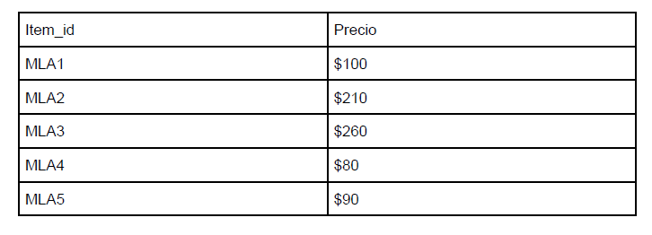

# Chanllenge-Cupon

Mercado Libre está implementando un nuevo beneficio para los usuarios que más usan la
plataforma con un cupón de cierto monto gratis que les permitirá comprar tantos ítems
marcados como favoritos que no excedan el monto total. Para esto se está analizando
construir una API que dado una lista de item_id y el monto total pueda darle la lista de ítems
que maximice el total gastado.
Aclaraciones:
- Sólo se puede comprar una unidad por item_id.
- No hay preferencia en la cantidad total de ítems siempre y cuando gasten el máximo
  posible.
- El precio puede contener hasta 2 decimales.

# Ejemplo
Asumiendo la siguiente lista de precios y un máximo de $500



La respuesta sería: [“MLA1”, “MLA2”, “MLA4”, “MLA5”]

## Tecnologias
* Java 21
* SpringBoot
* Gradle

## Nivel 1

POST → https://couponchallenge-96e0308989c0.herokuapp.com/coupon/

**REQUEST**

```json
{
  "item_ids": ["MLA1", "MLA2", "MLA3", "MLA4", "MLA5"],
  "amount": 500
}
```

**RESPONSE**

**Status:** 200 

```json
{
  "item_ids": ["MLA1", "MLA2", "MLA4", "MLA5"],
  "total": 480
}
```

**Status:** 404 si ingresa items duplicados
```json
{
  "status": 400,
  "error": "Bad Request",
  "message": "Duplicate items are not allowed: [MLA4]"
}
```
**Status:** 404 si el amount tiene mas de dos decimales
```json
{
  "status": 400,
  "error": "Bad Request",
  "message": "Amount must have at most two decimal places"
}
```
**Status:** 404 si se envia una lista vacia
```json
{
  "status": 400,
  "error": "Bad Request",
  "message": "Items list must not be empty."
}
```
**Status:** 404 si se envia un elemento de la lista vacio
```json
{
  "status": 400,
  "error": "Bad Request",
  "message": "There are empty or blank item_ids."
}
```
**Status:** 404 si el amount es menor o igual a 0
```json
{
  "status": 400,
  "error": "Bad Request",
  "message": "Amount must be greater than 0."
}
```

## Aclaraciones
* Para acceder a la API de Mercado Libre necesito generar un token que este solo vive por 6 horas
esta misma se encuentra declarada como variable de entorno
* Consumiendo la API de Mecado Libre solo puse acceder a items que yo publique dejo un listado
de cuales son con sus respectivos precios
  * MLA1308307288 -> 15000
  * MLA913343169 -> 14000
  * MLA1517572823 -> 13500
  * MLA1517482175 -> 19000

